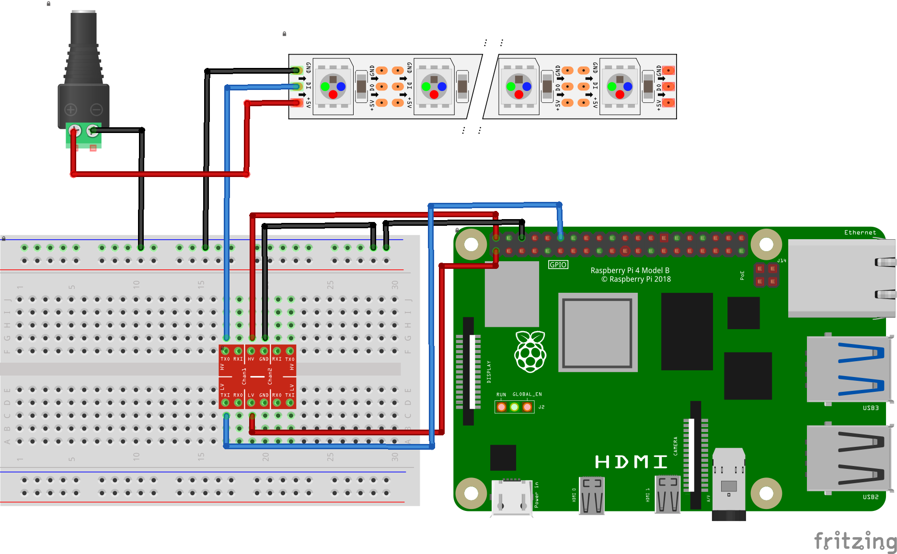
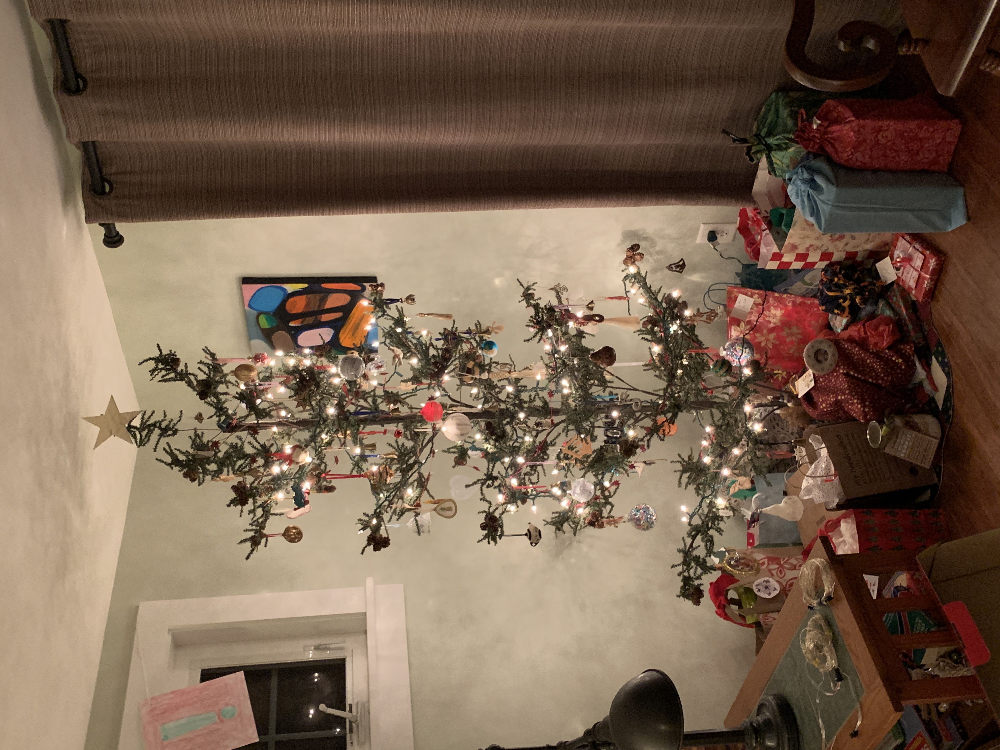
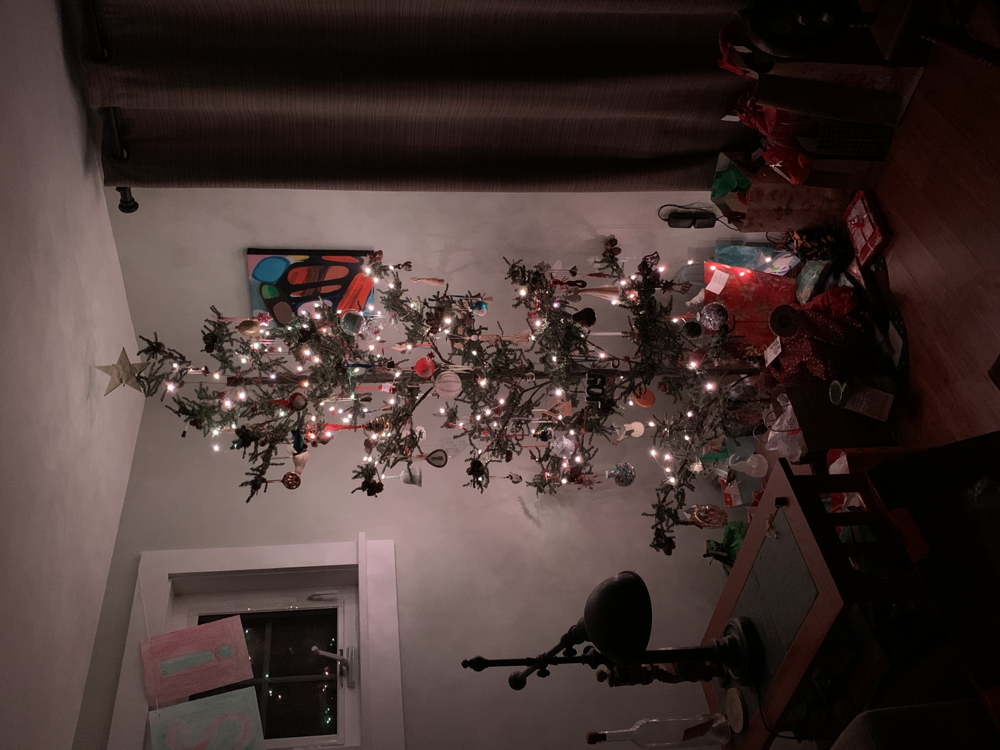

# PiXmasLights

This is the repository for my Christmas tree lights project, which turned my family's humble Christmas tree into an RGB lightshow.

## Table of Contents
* [Overview](#Overview)
* [Tools Used](#Tools-Used)
* [Material List](#Material-List)
* [Initial Prototype](#Initial-Prototype)
* [Programs](#Programs)
  - [Program List](#Program-List)
  - [Final Program](#final-program)
* [Completed Project](#Completed-Project)

 
 

## Overview

This project was created to transform our somewhat basic fake tree into a much brighter and fun fake tree. In the days leading up to Christmas, I tested and created the programs that would run on the tree (mostly with success), and on Christmas day I snuck downstairs early in the morning to replace the basic lights on the tree with my RGB ones. The process was relatively quick, and resulted in a successful installation of the RGB lights, and an equally successful reception by the rest of my family. The following documentation records my process throughout the project.

 

## Tools Used

* Code - [VS Code](https://code.visualstudio.com/)
* Wiring Diagram - [Fritzing](https://fritzing.org/)
* Minor Video Editing - [Kdenlive](https://kdenlive.org/en/)
* Soldering Iron
* Multimeter
* Wire cutters and strippers

 

## Material List

* Raspberry Pi 4B
* Raspberry Pi Case
* 3 WS2812B LED Strings
* 3.3V-5V Logic Converter
* 5V 3A Power Supply
* Breadboard
* Assorted wires

 

## Initial Prototype

My initial prototype was a simple program to make sure I could properly program the LED strings. This was unfortunately more difficult than I expected because I ran into some issues with the wiring initially, leading to a fried string of LEDs which I only realized I had fried several hours later. Eventually I found a wiring setup that worked for me, a diagram of which is pictured below. All that my initial prototype got the LEDs to do was to loop through the LEDs and turn each one red, and then turn them each off in another loop.

### Links and Images

[Link to Prototype Code](code_prototypes/test_LEDs.py)

**Wiring Diagram**

The logic voltages for the WS2812B (5V) and the Raspberry Pi 4 (3.3V) had to be converted so they could communicate. This was accomplished using a 3.3V-5V logic converter. Additionally, the Raspberry Pi couldn't provide enough power for the lights, so an external power supply was used. While wiring things into the Raspberry Pi, it can often be difficult to tell which GPIO pin you need to use for certain things, and I referenced [this image](https://miro.medium.com/max/4128/0*VsaGvGskvJa20hZa.png) many times.

 

## Programs

My process for creating the final program to run on the Christmas tree was to create several small programs which would each contain one of my final patterns. In my final program, I incorporated each of programs into a function for the pattern. The lights were programmed using Adafruit's CircuitPython, making use of the [neopixel library](https://circuitpython.readthedocs.io/projects/neopixel/en/latest/api.html) to control the lights. 

### Program List

* [alternating_colors.py](programs/alternating_colors.py)
* [basic_color.py](programs/basic_color.py)
* [chasing_lights.py](programs/chasing_lights.py)
* [fading_colors.py](programs/fading_colors.py)
* [find_rgb_values.py](programs/find_rgb_values.py)
* [random_matrix.py](programs/random_matrix.py)
* [reset_LEDs.py](programs/reset_LEDs.py)
* [stars.py](programs/stars.py)

### Final Program

The final program incorporated all the patterns I had created into a command line interface where each pattern could be selected. I had to incorporate the use of [threads](https://www.geeksforgeeks.org/start-and-stop-a-thread-in-python/) into the program so that there was a way of stopping a pattern while the program kept running. One thread controlled the lights, while another listened for input from the user to stop the pattern. 

The program also incorporated a couple functions to change the color and speed of the patterns, and fading functions to change the brightness of the whole string or an individual LED. These functions made setting a pattern on the tree much easier, although the process isn't particularly elegant, with the final program running in a [tmux](https://github.com/tmux/tmux) instance so it doesn't quit when the ssh session disconnects. There isn't some sort of fancy web interface or infrared remote control. 

#### [Link to Final program](programs/all_patterns.py)

 

## Completed Project

The final result of the project looked almost exactly as I had pictured, with the exception of two fairly minor details -- the LED lights weren't quite as bright as I wanted them to be because their power supply couldn't provide enough power, and the power supply for the Raspberry Pi produced a *very* high-pitched whine which was quite annoying. If I were to revisit the project in the future I would definitely revamp the power supply portion of the project. Additionally, I would probably find some way to get the X and Y coordinates for each of the LEDs so that I could make more complex, fun patterns.

Apart from some wiring consternation and a fried light string at the beginning of the project, I encountered hardly any issues. If you plan to replicate this project, definitely leave some room for error. I was certainly glad I did - buying an extra string of LEDs, extra voltage converters, etc.

### Images

| Original Lights | New Lights |
| --- | --- |
|  |  |
  
 

| Alternating Lights Pattern | Chasing Lights Pattern | Random Matrix Pattern | 
| --- | --- | --- |
|  |  |  |
